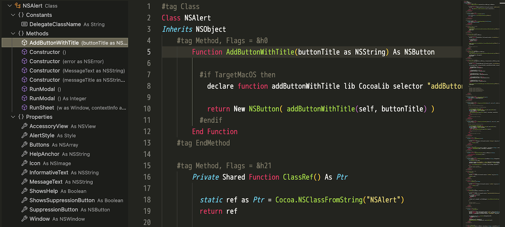

# Xojo Syntax Highlighting for VS Code

A lightweight syntax highlighting extension for the Xojo programming language.



## Features

### Syntax Highlighting

-   Comments (' / REM / // / #)
-   Strings (double quotes)
-   Numbers (integers and floats)
-   Control flow and declaration keywords
-   Primitive types
-   Function names (declarations and calls)

### Outline View (DocumentSymbolProvider)

-   **`.xojo_window`**: Window → Controls → Events/Methods/Properties/MenuHandlers
    -   Hierarchical control layout based on `InitialParent` attribute
    -   Display child controls under container controls like DesktopTabPanel
    -   `#tag Events` blocks with hierarchical support (correctly associates events with nested controls)
-   **`.xojo_code`**: Class/Module/Interface/Structure/Enum → Methods/Properties/Events/Constants
    -   Automatically applies appropriate group structure for each object type
    -   Supports both `#tag` blocks and free-form declarations
-   **`.xojo_menu`**: Menu → DesktopMenuItem → (Submenu items)
    -   Recursively parses menu hierarchies
    -   Displays `Text` attribute as menu item details
    -   Special handling for separators (`Text = "-"`)
-   **Generic code files**: Flat list of Sub/Function/Method/Event/Delegate declarations

### Xojo Integration (macOS only)

-   Xojo Reload and Run (F5 key or from Command Palette)
-   Auto-generate default `.vscode/launch.json` configuration

## Installation (Local Development)

1. Open this folder in VS Code
2. Start debugging the extension from Run and Debug (F5)
3. In the new VS Code window, open `.xojo_code` / `.xojo_script` files to verify syntax highlighting

## Package Creation (VSIX) and Local Installation

To use the extension in normal mode without debugging, create and install a VSIX package.

### Creating the VSIX

With Node.js installed, you can create the package with `npx`. Run from the project root:

```bash
cd vscode_xojo_syntax
npx @vscode/vsce package
```

On success, `xojo-syntax-<version>.vsix` will be generated in the project root.

### Installing the VSIX

-   From VS Code Command Palette → "Extensions: Install from VSIX…" and select the `.vsix` file
-   Or from CLI:

```bash
code --install-extension xojo-syntax-0.1.0.vsix
```

To reinstall the same version, add `--force`:

```bash
code --install-extension xojo-syntax-0.1.0.vsix --force
```

### Version Update Tips

-   Increment the `version` in `package.json` before repackaging to allow updates without `--force`.
-   If you plan to publish to the Marketplace in the future, adjust `.vscodeignore` to include the README and other documentation (currently excluded).

## Supported Files

-   Language ID: `xojo`
-   Extensions: `.xojo_code`, `.xojo_script`, `.xojo_window`, `.xojo_menu`

## Known Limitations

-   Not fully compatible with the official Xojo IDE
-   Minimal string escape sequence handling

## License

MIT
