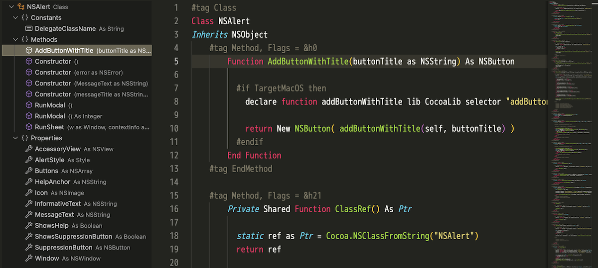

# Xojo Syntax Highlighting for VS Code

Xojo 言語向けの軽量なシンタックスハイライト拡張です。



## できること

### シンタックスハイライト

-   コメント（' / REM / // / #）
-   文字列（ダブルクォート）
-   数値（整数・浮動小数）
-   制御/宣言キーワード
-   一部のプリミティブ型
-   関数名（宣言/呼び出し）

### アウトライン機能（DocumentSymbolProvider）

-   **`.xojo_window`**: Window → Controls → Events/Methods/Properties/MenuHandlers
    -   `InitialParent`属性による階層的なコントロール配置
    -   DesktopTabPanel 等のコンテナコントロール配下に子コントロールを表示
    -   `#tag Events`ブロックで階層対応（ネストされたコントロールのイベントを正しく親子付け）
-   **`.xojo_code`**: Class/Module/Interface/Structure/Enum → Methods/Properties/Events/Constants
    -   オブジェクト種別ごとに適切なグループ構造を自動適用
    -   `#tag`ブロックと自由形式の両方に対応
-   **`.xojo_menu`**: Menu → DesktopMenuItem → (サブメニュー項目)
    -   メニュー階層を再帰的に解析
    -   `Text`属性をメニュー項目の詳細情報として表示
    -   セパレーター（`Text = "-"`）を特別扱い
-   **汎用コードファイル**: Sub/Function/Method/Event/Delegate のフラットリスト

### Xojo 連携機能（macOS）

-   Xojo Reload and Run（F5 キーまたはコマンドパレットから実行）
-   `.vscode/launch.json`のデフォルト設定を自動生成

## インストール（ローカル開発）

1. このフォルダを VS Code で開く
2. 実行とデバッグから「拡張機能のデバッグ」を開始（F5）
3. 新しい VS Code ウィンドウで `.xojo_code` / `.xojo_script` を開いて色分けを確認

## パッケージ作成（VSIX）とローカルインストール

ローカルでデバッグ不要の通常モードで使う場合は、VSIX を作成してインストールします。

### VSIX の作成

Node.js が入っていれば `npx` で一発です。プロジェクトのルートで実行します。

```bash
cd vscode_xojo_syntax
npx @vscode/vsce package
```

実行に成功すると、プロジェクト直下に `xojo-syntax-<version>.vsix` が生成されます。

### VSIX のインストール

-   VS Code のコマンドパレット →「Extensions: Install from VSIX…」で `.vsix` を選択
-   あるいは CLI から:

```bash
code --install-extension xojo-syntax-0.1.0.vsix
```

同じバージョンを再インストールする場合は `--force` を付けます。

```bash
code --install-extension xojo-syntax-0.1.0.vsix --force
```

### バージョン更新のコツ

-   `package.json` の `version` を上げてから再パッケージすると、上書き時に `--force` を付けずに更新扱いで入れ替えられます。
-   将来 Marketplace 公開を想定する場合は `.vscodeignore` を調整して README などを含める運用に変更してください（現状は除外設定）。

## 拡張対象

-   言語 ID: `xojo`
-   拡張子: `.xojo_code`, `.xojo_script`, `.xojo_window`, `.xojo_menu`

## 既知の制限

-   実運用の Xojo IDE と完全互換ではありません
-   文字列内エスケープは最小限です

## ライセンス

MIT
